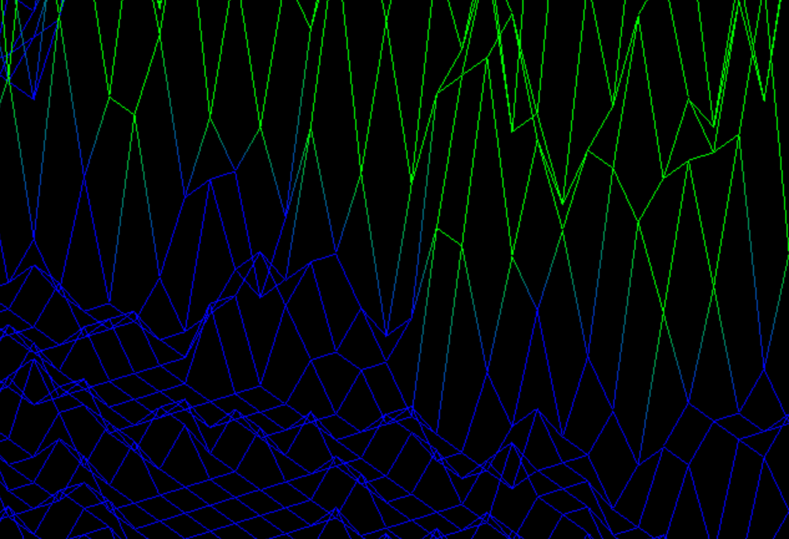
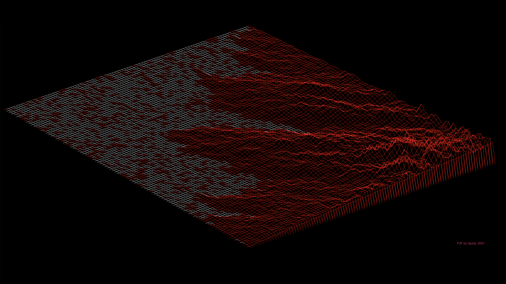

# FdF by lajudy#

###About the Task
TODO: This project is about creating a simplified graphic “wireframe” (“fils de fer” in French, hence the name of the project) representation of a relief landscape linking various points (x, y, z) via segments. The coordinates of this landscape are stored in a file passed as a parameter to your program

[FdF.pdf](06_FdF.pdf) 
### Usage
Compile using the command: `make`\
Then run the program with the command: `./fdf maps/the_map_you_want.fdf`

###Features
+ handling huge and super-huge maps
+ handling colors
+ smooth gradient
+ 3 projections
+ translation over the scene
+ mouse wheel handling
  
### Control
`A` `W` `D` `S` — translate over the scene (also `←` `↑` `→` `↓`) 
`[` `]` — rotation 
`C` — turn on/off colors 
`mouse wheel rotation` — zoom in/out 
`1` `2` `3` — change projection 

###Wallpaper for you☺️

## Compatibility

This project is based on a grapical library named "minilibx" provided by 42.\
\
This repository includes the minilibx version which is compatible with MacOS. This program should then run on MacOS without any problem.\
However this program won't work on Linux-based systems, since another version of the minilibx (which is not included here) is needed.